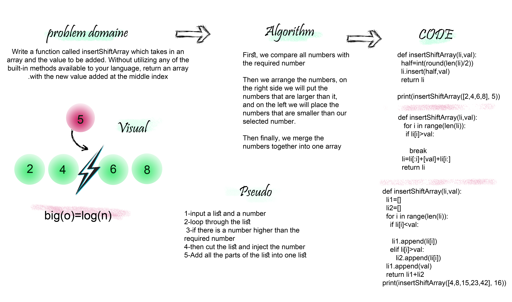

# Array Shift
manipulate an array and rearrange it in reversed order
## Challenge
we will Write a function called Array Shift which takes an array and a number as an argument.and return an array with .

## Approach & Efficiency
 Big O =log(n) it seems like a binary search #I am not sure

 

## Solution
<!--  -->

## link
https://github.com/maisjamil1/data-structures-and-algorithms/pull/4

_________________________________________________________
- [ ] Top-level README “Table of Contents” is updated
- [ ] Feature tasks for this challenge are completed
- [ ] Unit tests written and passing
- [ ] “Happy Path” - Expected outcome
- [ ] Expected failure
- [ ] Edge Case (if applicable/obvious)
- [ ] README for this challenge is complete
- [ ] Summary, Description, Approach & Efficiency, Solution
- [ ] Link to code
- [ ] Picture of whiteboard