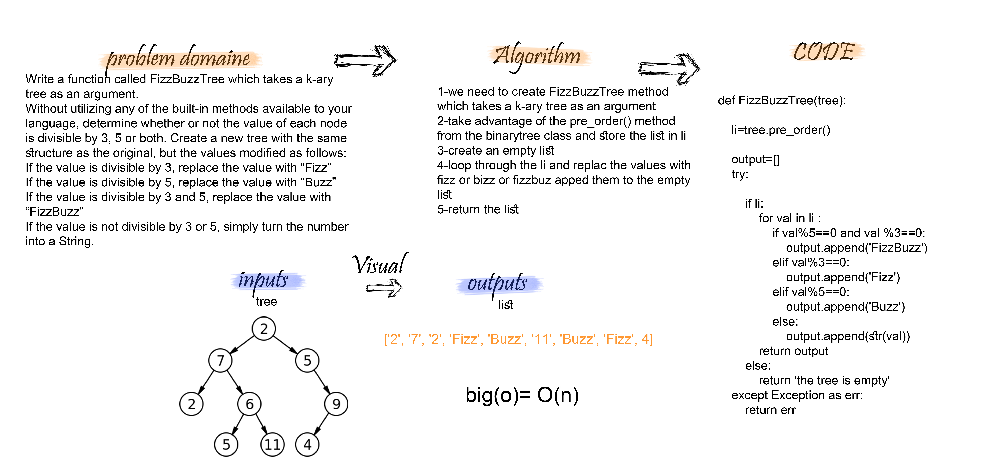

# FIZZBUZZTREE
## Challenge
Write a function called FizzBuzzTree which takes a k-ary tree as an argument.
Without utilizing any of the built-in methods available to your language, determine whether or not the value of each node is divisible by 3, 5 or both. Create a new tree with the same structure as the original, but the values modified as follows:
If the value is divisible by 3, replace the value with “Fizz”
If the value is divisible by 5, replace the value with “Buzz”
If the value is divisible by 3 and 5, replace the value with “FizzBuzz”
If the value is not divisible by 3 or 5, simply turn the number into a String.

## Approach & Efficiency
 - Big O => for FizzBuzzTree function ----> O(n)

## Solution

## link
https://github.com/maisjamil1/data-structures-and-algorithms/pull/26

_________________________________________________________
- [ ] Top-level README “Table of Contents” is updated
- [ ] Feature tasks for this challenge are completed
- [ ] Unit tests written and passing
- [ ] “Happy Path” - Expected outcome
- [ ] Expected failure
- [ ] Edge Case (if applicable/obvious)
- [ ] README for this challenge is complete
- [ ] Summary, Description, Approach & Efficiency, Solution
- [ ] Link to code
- [ ] Picture of whiteboard

## Note :