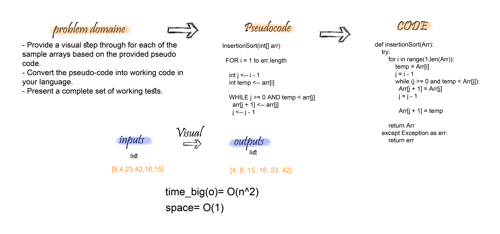
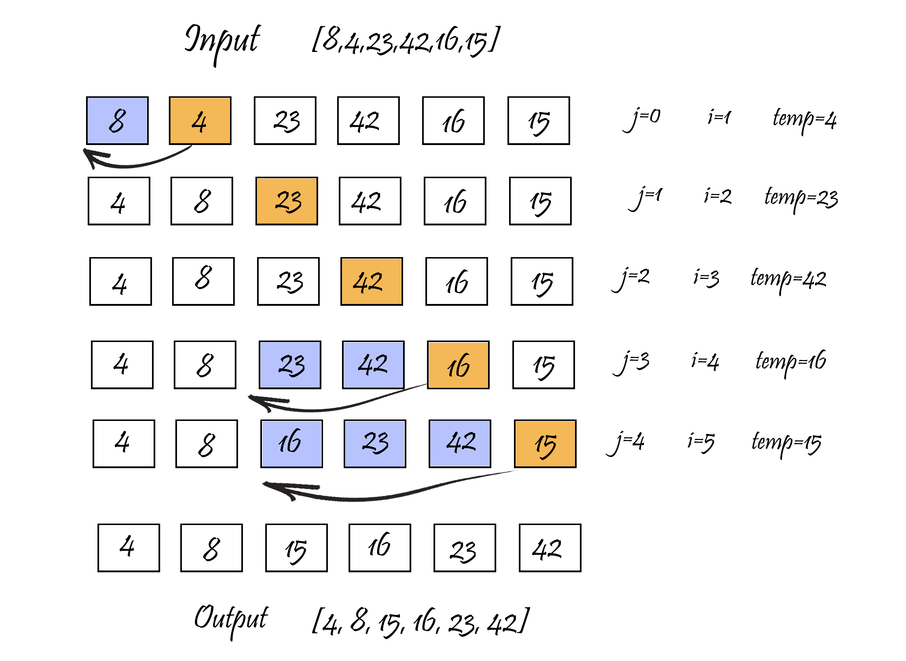

# Insertion Sort
## Challenge
- Provide a visual step through for each of the sample arrays based on the provided pseudo code.
- Convert the pseudo-code into working code in your language.
- Present a complete set of working tests.


## Approach & Efficiency
 - Big O => for InsertionSort function ----> O(n^2)
 - Space => O(1) ---> because we just sorted the list  O(1).


### Pseudocode
```
  InsertionSort(int[] arr)
  
    FOR i = 1 to arr.length
    
      int j <-- i - 1
      int temp <-- arr[i]
      
      WHILE j >= 0 AND temp < arr[j]
        arr[j + 1] <-- arr[j]
        j <-- j - 1
        
      arr[j + 1] <-- temp

```
## Solution





## link
https://github.com/maisjamil1/data-structures-and-algorithms/pull/28

_________________________________________________________
- [ ] Top-level README “Table of Contents” is updated
- [ ] Feature tasks for this challenge are completed
- [ ] Unit tests written and passing
- [ ] “Happy Path” - Expected outcome
- [ ] Expected failure
- [ ] Edge Case (if applicable/obvious)
- [ ] README for this challenge is complete
- [ ] Summary, Description, Approach & Efficiency, Solution
- [ ] Link to code
- [ ] Picture of whiteboard


