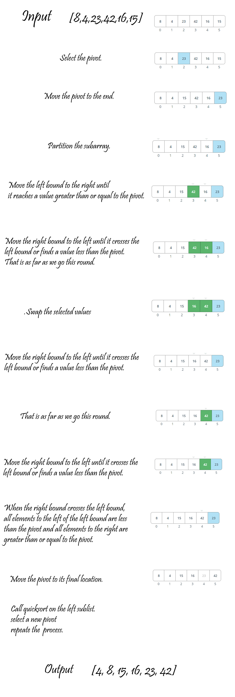

# Quick Sort
QuickSort is a Divide and Conquer algorithm. It picks an element as pivot and partitions the given array around the picked pivot. 
## Challenge
- Review the pseudocode below, then trace the algorithm by stepping through the process with the provided sample array

## Approach & Efficiency
 - Big O => for quick Sort function ----> O(n^2)
 - Space => O(1) ---> because we just sorted the list  O(1).

## Pseudocode
```

ALGORITHM QuickSort(arr, left, right)
    if left < right
        // Partition the array by setting the position of the pivot value 
        DEFINE position <-- Partition(arr, left, right)
        // Sort the left
        QuickSort(arr, left, position - 1)
        // Sort the right
        QuickSort(arr, position + 1, right)

ALGORITHM Partition(arr, left, right)
    // set a pivot value as a point of reference
    DEFINE pivot <-- arr[right]
    // create a variable to track the largest index of numbers lower than the defined pivot
    DEFINE low <-- left - 1
    for i <- left to right do
        if arr[i] <= pivot
            low++
            Swap(arr, i, low)

     // place the value of the pivot location in the middle.
     // all numbers smaller than the pivot are on the left, larger on the right. 
     Swap(arr, right, low + 1)
    // return the pivot index point
     return low + 1

ALGORITHM Swap(arr, i, low)
    DEFINE temp;
    temp <-- arr[i]
    arr[i] <-- arr[low]
    arr[low] <-- temp


```

## Code
```
def QuickSort(arr, left, right):
  if left < right:
    position = Partition(arr, left, right)
    QuickSort(arr, left, position - 1)
    QuickSort(arr, position + 1, right)
  return arr


def Partition(arr, left, right):
  pivot = arr[right]
  low = left - 1
  i = left
  while i < right:
    if (arr[i] <= pivot):
      low+=1
      Swap(arr, i, low)
    i+=1
  Swap(arr, right, low + 1)
  return low + 1


def Swap(arr, i, low):
  temp = arr[i]
  arr[i] = arr[low]
  arr[low] = temp

```


## Solution





## link
https://github.com/maisjamil1/data-structures-and-algorithms/pull/33

_________________________________________________________
- [ ] Top-level README “Table of Contents” is updated
- [ ] Feature tasks for this challenge are completed
- [ ] Unit tests written and passing
- [ ] “Happy Path” - Expected outcome
- [ ] Expected failure
- [ ] Edge Case (if applicable/obvious)
- [ ] README for this challenge is complete
- [ ] Summary, Description, Approach & Efficiency, Solution
- [ ] Link to code
- [ ] Picture of whiteboard
