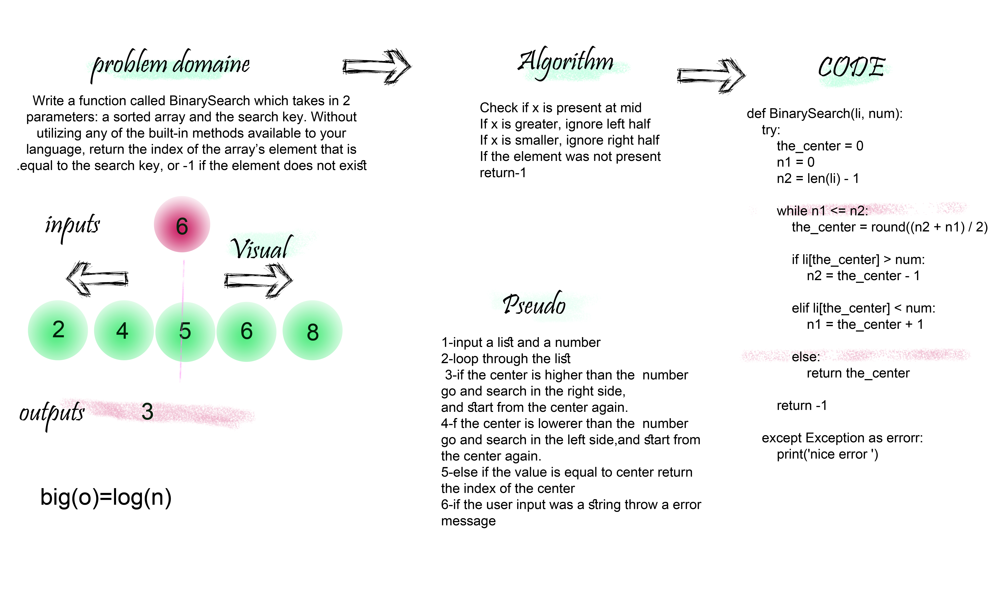

# BinarySearch
Write a function called BinarySearch which takes in 2 parameters: a sorted array and the search key. Without utilizing any of the built-in methods available to your language, return the index of the array’s element that is equal to the search key, or -1 if the element does not exist.

## Approach & Efficiency
 Big O =log(n)

## Solution

## link
https://github.com/maisjamil1/data-structures-and-algorithms/pull/5

_________________________________________________________
- [ ] Top-level README “Table of Contents” is updated
- [ ] Feature tasks for this challenge are completed
- [ ] Unit tests written and passing
- [ ] “Happy Path” - Expected outcome
- [ ] Expected failure
- [ ] Edge Case (if applicable/obvious)
- [ ] README for this challenge is complete
- [ ] Summary, Description, Approach & Efficiency, Solution
- [ ] Link to code
- [ ] Picture of whiteboard