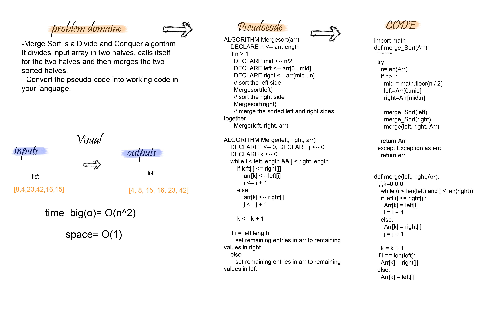
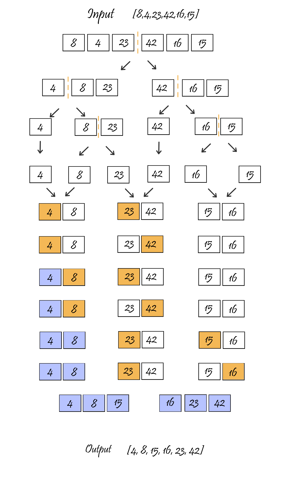

# Merge Sort
Merge Sort is a Divide and Conquer algorithm. It divides input array in two halves, calls itself for the two halves and then merges the two sorted halves.
## Challenge
- Review the pseudocode below, then trace the algorithm by stepping through the process with the provided sample array

## Approach & Efficiency
 - Big O => for mergeSort function ----> O(n^2)
 - Space => O(1) ---> because we just sorted the list  O(1).

## Pseudocode
```

ALGORITHM Mergesort(arr)
    DECLARE n <-- arr.length
           
    if n > 1
      DECLARE mid <-- n/2
      DECLARE left <-- arr[0...mid]
      DECLARE right <-- arr[mid...n]
      // sort the left side
      Mergesort(left)
      // sort the right side
      Mergesort(right)
      // merge the sorted left and right sides together
      Merge(left, right, arr)

ALGORITHM Merge(left, right, arr)
    DECLARE i <-- 0
    DECLARE j <-- 0
    DECLARE k <-- 0

    while i < left.length && j < right.length
        if left[i] <= right[j]
            arr[k] <-- left[i]
            i <-- i + 1
        else
            arr[k] <-- right[j]
            j <-- j + 1
            
        k <-- k + 1

    if i = left.length
       set remaining entries in arr to remaining values in right
    else
       set remaining entries in arr to remaining values in left


```

## Code
```
import math
def merge_Sort(Arr):
  """ """
  try:
    n=len(Arr)
    if n>1:
      mid = math.floor(n / 2)
      left=Arr[0:mid]
      right=Arr[mid:n]

      merge_Sort(left)
      merge_Sort(right)
      merge(left, right, Arr)

    return Arr
  except Exception as err:
    return err


def merge(left, right,Arr):
  i,j,k=0,0,0
    while (i < len(left) and j < len(right)):
    if left[i] <= right[j]:
      Arr[k] = left[i]
      i = i + 1
    else:
      Arr[k] = right[j]
      j = j + 1

    k = k + 1
  if i == len(left):
    Arr[k] = right[j]
  else:
    Arr[k] = left[i]

```


## Solution





## link
https://github.com/maisjamil1/data-structures-and-algorithms/pull/29

_________________________________________________________
- [ ] Top-level README “Table of Contents” is updated
- [ ] Feature tasks for this challenge are completed
- [ ] Unit tests written and passing
- [ ] “Happy Path” - Expected outcome
- [ ] Expected failure
- [ ] Edge Case (if applicable/obvious)
- [ ] README for this challenge is complete
- [ ] Summary, Description, Approach & Efficiency, Solution
- [ ] Link to code
- [ ] Picture of whiteboard
